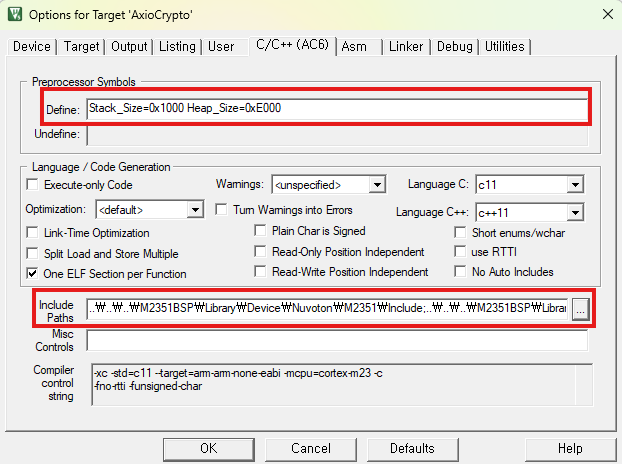
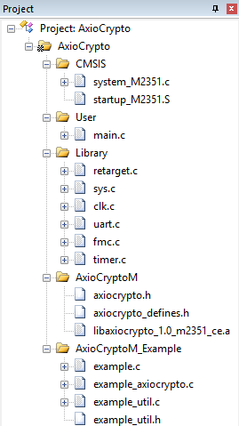
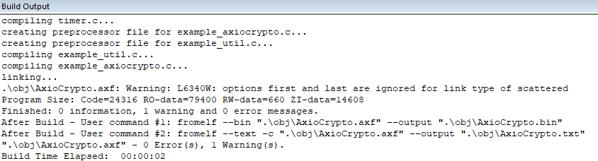
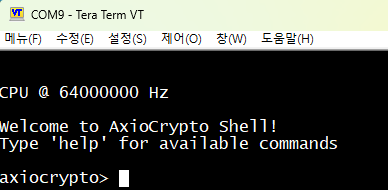
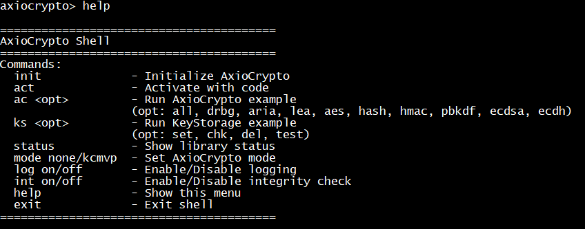
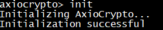
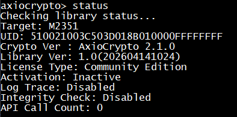
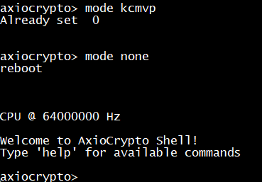
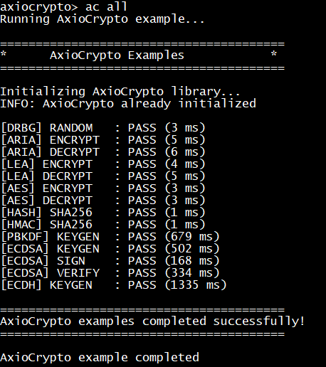

# AxioCryptoM v1 Example - M2351

> English version: [README.md](README.md)

## 개요

Nuvoton M2351 (Cortex-M23) 를 대상으로 하는 AxioCryptoM v1 라이브러리 예제 프로젝트입니다.

---

## 개발 환경

| 항목 | 내용 |
|------|------|
| MCU | Nuvoton M2351 (Cortex-M23) |
| Core Clock | 64 MHz |
| Toolchain | Keil MDK |
| Board | NuMaker-PFM-M2351 |
| Debug Interface | Nu-Link |
| Debug UART | UART0 (PB12: RXD, PB13: TXD), 115200 bps |

---

## 디렉토리 배치

권장 구조:

```text
workspace/
├─ axiocrypto_examples/
├─ M2351BSP/
└─ M2351/
   ├─ docs/
   ├─ lib/
   └─ project/
```

### M2351BSP Download

프로젝트는 M2351BSP 저장소를 아래와 같이 clone한 후 구성해야 합니다.

```bash
git clone https://github.com/OpenNuvoton/M2351BSP.git
```

> **중요:** `project/Keil/AxioCrypto.uvprojx`는 `../../M2351BSP/..` 경로를 사용합니다.
> 경로가 맞지 않으면 Keil에서 BSP 관련 소스를 찾지 못합니다.

---

## 메모리 레이아웃

M2351 전체 메모리 용량:

| 구분 | Flash | RAM |
|------|-------|-----|
| M2351 Total | 512 KB | 96 KB |

### Flash (총 512 KB : 0x00000000 ~ 0x00080000)

| 주소 | 크기 | 영역 설명 |
|------|------|----------|
| `0x00000000` ~ `0x00001000` | 4 KB | 벡터 테이블 / 스타트업 코드 |
| `0x00001000` ~ `0x00008000` | 28 KB | 미사용 영역 |
| `0x00008000` ~ `0x00019FFF` | 72 KB | **AxioCrypto 라이브러리 코드** |
| `0x0001A000` ~ `0x00080000` | 408 KB | 애플리케이션 코드 |

### RAM (총 96 KB : 0x20000000 ~ 0x20018000)

| 주소 | 크기 | 영역 설명 |
|------|------|----------|
| `0x20000000` ~ `0x20007000` | 28 KB | 스택 영역 |
| `0x20007000` ~ `0x20007FFF` | 4 KB | **AxioCrypto 데이터 영역** |
| `0x20008000` ~ `0x20018000` | 64 KB | 애플리케이션 데이터 영역 |

### 메모리 주의사항

- 고객 펌웨어의 코드 및 데이터는 AxioCrypto 예약 영역과 겹치면 안 됩니다.
- Stack 및 Heap 설정 시 AxioCrypto RAM 영역과 충돌하지 않도록 해야 합니다.
- 고객사 프로젝트의 scatter file 또는 linker script에서 AxioCrypto Flash/RAM 영역을 반드시 설정해야 합니다.
- 최종 펌웨어 빌드 후 메모리 맵을 확인하여 영역 충돌이 없는지 검증해야 합니다.

---

## 프로젝트 구조

```
AxioCrypto (Keil Project)
├── CMSIS/
│   ├── system_M2351.c          # 시스템 초기화
│   └── startup_M2351.S         # 스타트업 코드 / 벡터 테이블
├── User/
│   └── main.c                  # 메인 소스 파일
├── Library/
│   ├── retarget.c              # printf 리타겟 (UART)
│   ├── sys.c                   # 시스템 클럭 드라이버
│   ├── clk.c                   # 클럭 드라이버
│   ├── uart.c                  # UART 드라이버
│   ├── timer.c                 # 타이머 드라이버 (AxioCrypto 필수)
│   └── fmc.c                   # FMC 드라이버 (AxioCrypto 필수)
└── AxioCrypto/
    ├── libaxiocrypto_1.0_m2351_ce.a    # AxioCrypto 라이브러리 (prebuilt)
    ├── axiocrypto.h                     # AxioCrypto 메인 헤더
    ├── example.c                        # 예제 진입점
    ├── example_axiocrypto.c             # AxioCrypto 예제
    ├── example_util.c                   # 예제 유틸리티
    └── example_util.h                   # 예제 유틸리티 헤더
```

---

## AxioCrypto 연동 가이드

### 메모리 요구사항

| 영역 | 최소 요구 크기 |
|------|---------------|
| Stack | 2 KB 이상 |
| Heap | 16 KB 이상 |

### 빌드 요구사항

AxioCrypto 라이브러리 사용 시 아래 드라이버 소스 파일을 프로젝트에 포함해야 합니다.

| 파일 | 설명 |
|------|------|
| `TIMER.C` | 타이머 드라이버 |
| `FMC.C` | Flash Memory Controller 드라이버 |

### 전용 하드웨어 모듈

AxioCrypto 라이브러리는 내부적으로 아래 하드웨어 모듈을 사용합니다.

| 모듈 | 비고 |
|------|------|
| TIMER0 | AxioCrypto 전용 사용 |
| CRYPTO | AxioCrypto 전용 사용 |

### 주의사항

- TIMER0 및 CRYPTO 모듈을 애플리케이션에서 직접 사용할 경우, 암호 모듈이 오동작할 수 있습니다.
- AxioCrypto API 호출 전에 반드시 `SYS_UnlockReg()` 가 호출된 상태이어야 합니다.
- AxioCrypto API는 Thread-Safe를 보장하지 않습니다. 멀티스레드 환경에서 여러 스레드가 동시에 이 API를 호출할 경우 예기치 않은 동작이 발생할 수 있으므로 주의하십시오.

---

## Keil 프로젝트 설정

### 프로젝트 열기

Keil에서 아래 파일을 엽니다.

```text
project/Keil/AxioCrypto.uvprojx
```

### Define 설정 및 Include Path 확인

`Options for Target -> C/C++`에서 define 값 확인:

```c
Stack_Size=0x1000 Heap_Size=0xE000
```

아래 경로가 포함되어 있어야 합니다.

- `M2351BSP/Library/Device/Nuvoton/M2351/Include`
- `M2351BSP/Library/CMSIS/Include`
- `M2351BSP/Library/StdDriver/inc`
- `lib/include`



### Library 및 예제 파일 확인

프로젝트에 다음 파일이 포함되어 있어야 합니다.

- `libaxiocrypto_1.0_m2351_ce.a`
- `example.c`
- `example_axiocrypto.c`
- `example_util.c`



---

## 빌드

Keil에서 `Build`를 실행합니다.

정상 빌드 시 다음을 확인합니다.

- 컴파일 에러 없음
- 링크 에러 없음
- `.axf` 생성 완료

권장 확인 포인트:

- scatter file `m2351.sct`가 적용되었는지
- `.axiocrypto_code` 영역과 다른 섹션이 충돌하지 않는지
- stack/heap 관련 region overlap 에러가 없는지




---

## UART 터미널 연결

UART0 기준으로 터미널을 연결합니다.

| 항목 | 설정 |
|------|------|
| Baud Rate | 115200 |
| Data Bits | 8 |
| Parity | None |
| Stop Bits | 1 |
| Flow Control | None |

---

## 펌웨어 다운로드

1. Keil에서 Download를 수행합니다.
2. 리셋 후 초기 화면이 출력되는지 확인합니다.




---

## 예제 실행

보드를 연결하고 펌웨어를 다운로드한 후, UART0 터미널에서 AxioCrypto Shell을 통해 예제를 실행할 수 있습니다.

### 기본 실행 절차

#### 1. 도움말 확인

```text
help
```



#### 2. 라이브러리 초기화

```text
init
```



#### 3. 모듈 활성화

```text
act
```


#### 4. 상태 확인

```text
status
```



#### 5. 검증 모드 설정 (선택)

비검증 알고리즘(AES) 테스트를 하기 위해서는 검증 모드를 none으로 변경해야 합니다.

- 현재 설정된 mode와 요청 mode를 비교합니다.
- 변경이 필요한 경우 `axiocrypto_set_mode()`를 호출하며, 이후 **리부팅**됩니다.
- 이미 동일한 mode로 설정된 경우에는 변경하지 않습니다.

```text
mode none
mode kcmvp
```



---

### AxioCrypto 알고리즘 예제

#### 전체 실행

```text
ac all
```

#### 개별 실행

```text
ac drbg
ac aria
ac lea
ac aes
ac hash
ac hmac
ac pbkdf
ac ecdsa
ac ecdh
```

성공 시 예제별로 `PASS`와 함께 수행 시간이 출력됩니다.



---

### KeyStorage 사용 예제

ARIA 암복호화용 키를 KeyStorage에 저장하여 사용하는 예제입니다.

| 명령어 | 설명 |
|--------|------|
| `ks set` | 키 저장 |
| `ks chk` | 키 확인 |
| `ks test` | KeyStorage에 저장된 키로 암/복호화 테스트 수행 |
| `ks del` | 키 삭제 |


---
