# AxioCryptoM v1 Example - M2354

> Korean version: [README_KR.md](README_KR.md)

## Overview

This is an AxioCryptoM v1 library example project targeting the Nuvoton M2354 (Cortex-M23).

---

## Development Environment

| Item | Description |
|------|-------------|
| MCU | Nuvoton M2354 (Cortex-M23) |
| Core Clock | 96 MHz |
| Toolchain | Keil MDK |
| Board | NuMaker-PFM-M2354 |
| Debug Interface | Nu-Link |
| Debug UART | UART0 (PA6: RXD, PA7: TXD), 115200 bps |

---

## Directory Structure

Recommended layout:

```text
workspace/
├─ axiocrypto_examples/
├─ M2354BSP/
└─ M2354/
   ├─ docs/
   ├─ lib/
   └─ project/
```

### M2354BSP Download

Clone the M2354BSP repository as shown below before setting up the project.
Please use M2354BSP version v3.00.005.
```bash
git clone https://github.com/OpenNuvoton/M2354BSP.git
git -C M2354BSP checkout v3.00.005
```

> **Important:** `project/Keil/AxioCrypto.uvprojx` uses the relative path `../../M2354BSP/..`.
> If the path does not match, Keil will fail to locate BSP-related sources.

---

## Memory Layout

M2354 total memory capacity:

| Type | Flash | RAM |
|------|-------|-----|
| M2354 Total | 1024 KB | 256 KB |

### Flash (Total 1 MB : 0x00000000 ~ 0x00100000)

| Address | Size | Region |
|---------|------|--------|
| `0x00000000` ~ `0x00001000` | 4 KB | Vector table / Startup code |
| `0x00001000` ~ `0x00008000` | 28 KB | Unused |
| `0x00008000` ~ `0x00019FFF` | 72 KB | **AxioCrypto library code (reserved)** |
| `0x0001A000` ~ `0x00100000` | 920 KB | Application code |

### RAM (Total 256 KB : 0x20000000 ~ 0x20040000)

| Address | Size | Region |
|---------|------|--------|
| `0x20000000` ~ `0x20007000` | 28 KB | Stack area |
| `0x20007000` ~ `0x20007FFF` | 4 KB | **AxioCrypto data area (reserved)** |
| `0x20008000` ~ `0x20040000` | 224 KB | Application data area |

### Memory Notes

- Customer firmware code and data must not overlap with the AxioCrypto reserved regions.
- Ensure Stack and Heap settings do not conflict with the AxioCrypto RAM region.
- The AxioCrypto Flash/RAM regions must be configured in the customer project's scatter file or linker script.
- After the final firmware build, verify the memory map to confirm there are no region conflicts.

---

## Project Structure

```
AxioCrypto (Keil Project)
├── CMSIS/
│   ├── system_M2354.c          # System initialization
│   └── startup_M2354.s         # Startup code / Vector table
├── User/
│   └── main.c                  # Main source file
├── Library/
│   ├── retarget.c              # printf retarget (UART)
│   ├── sys.c                   # System clock driver
│   ├── clk.c                   # Clock driver
│   ├── uart.c                  # UART driver
│   ├── timer.c                 # Timer driver (required by AxioCrypto)
│   └── fmc.c                   # FMC driver (required by AxioCrypto)
└── AxioCryptoM/
    ├── libaxiocrypto_1.0_m2354_ce.a  # AxioCrypto library (prebuilt)
    ├── axiocrypto.h                     # AxioCrypto main header
    ├── axiocrypto_pqc.h                 # PQC (Post-Quantum Cryptography) header
    ├── example.c                        # Example entry point
    ├── example_axiocrypto.c             # AxioCrypto examples
    ├── example_pqc.c                    # PQC examples
    ├── example_util.c                   # Example utilities
    └── example_util.h                   # Example utilities header
```

### Keil Project Files

```
Keil/
├── AxioCrypto.uvprojx   # Keil project file
├── AxioCrypto.uvoptx    # Keil options file
├── m2354.sct            # Scatter file (memory map settings)
├── Nu_Link_Driver.ini   # Nu-Link debugger configuration
├── obj/                 # Build object output directory
└── lst/                 # Build listing output directory
```

---

## AxioCrypto Integration Guide

### Memory Requirements

| Region | Minimum Size |
|--------|--------------|
| Stack | 2 KB or more |
| Heap | 16 KB or more |

### Build Requirements

The following driver source files must be included in the project when using the AxioCrypto library.

| File | Description |
|------|-------------|
| `TIMER.C` | Timer driver |
| `FMC.C` | Flash Memory Controller driver |

### Dedicated Hardware Modules

The AxioCrypto library uses the following hardware modules internally.

| Module | Note |
|--------|------|
| TIMER0 | Reserved for AxioCrypto exclusive use |
| CRYPTO | Reserved for AxioCrypto exclusive use |

### Notes

- If TIMER0 or CRYPTO modules are used directly by the application, the cryptographic module may malfunction.
- `SYS_UnlockReg()` must be called before any AxioCrypto API call.
- AxioCrypto APIs are not Thread-Safe. Calling these APIs simultaneously from multiple threads in a multi-threaded environment may cause unexpected behavior.

---

## Keil Project Setup

### Opening the Project

Open the following file in Keil.

```text
project/Keil/AxioCrypto.uvprojx
```

### Verify Define Settings and Include Paths

Check the define values in `Options for Target -> C/C++`:

```c
Stack_Size=0x7000 Heap_Size=0x18000
```

The following paths must be included:

- `M2354BSP/Library/Device/Nuvoton/M2354/Include`
- `M2354BSP/Library/CMSIS/Include`
- `M2354BSP/Library/StdDriver/inc`
- `lib/include`

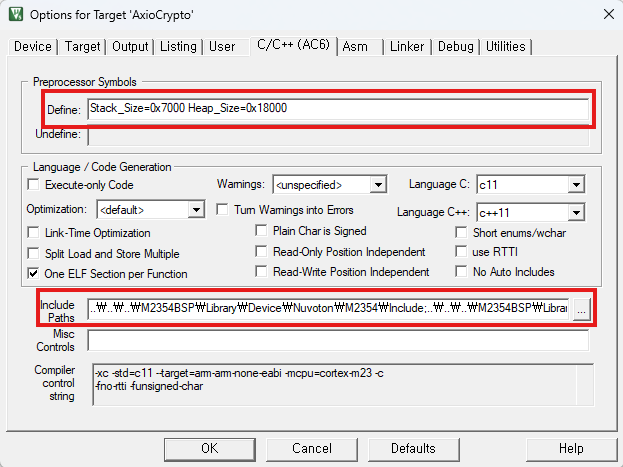

### Verify Library and Example Files

Confirm the following files are included in the project:

- `libaxiocrypto_1.0_m2354_ce.a`
- `example.c`
- `example_axiocrypto.c`
- `example_pqc.c`
- `example_util.c`

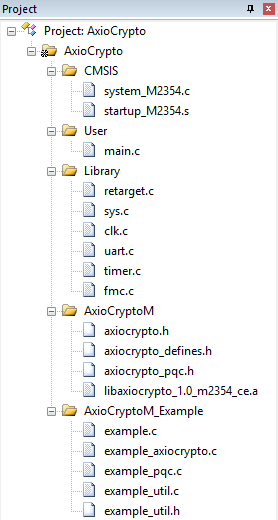

---

## Build

Run `Build` in Keil.

Confirm the following on a successful build:

- No compile errors
- No link errors
- `.axf` file generated

Recommended checkpoints:

- Verify scatter file `m2354.sct` is applied
- Confirm `.axiocrypto_code` region does not conflict with other sections
- Confirm no stack/heap region overlap errors

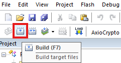

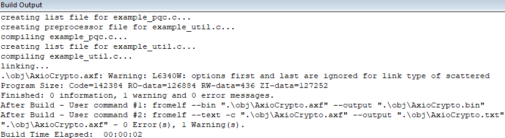

---

## UART Terminal Connection

Connect a terminal to UART0 with the following settings.

| Item | Setting |
|------|---------|
| Baud Rate | 115200 |
| Data Bits | 8 |
| Parity | None |
| Stop Bits | 1 |
| Flow Control | None |

---

## Firmware Download

1. Perform Download in Keil.
2. Confirm the initial screen is displayed after reset.

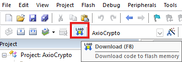

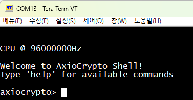

---

## Running Examples

After connecting the board and downloading the firmware, run examples via the AxioCrypto Shell on the UART0 terminal.

### Basic Procedure

#### 1. Show Help

```text
help
```

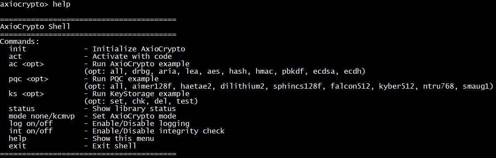

#### 2. Initialize Library

```text
init
```


#### 3. Activate Module

```text
act
```

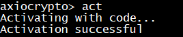

#### 4. Check Status

```text
status
```

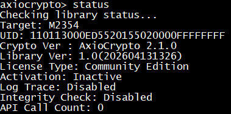

#### 5. Set Validation Mode (Optional)

To test non-validated algorithms (e.g., AES), change the validation mode to `none`.

- Compares the current mode with the requested mode.
- If a change is required, `axiocrypto_set_mode()` is called and the device **reboots**.
- If the mode is already set to the requested value, no change is made.

```text
mode none
mode kcmvp
```

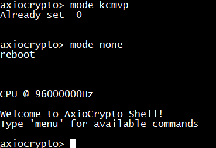

---

### AxioCrypto Algorithm Examples

#### Run All

```text
ac all
```

#### Run Individually

```text
ac drbg
ac aria
ac lea
ac aes
ac hash
ac hmac
ac pbkdf
ac ecdsa
ac ecdh
```

On success, each example prints `PASS` along with the execution time.

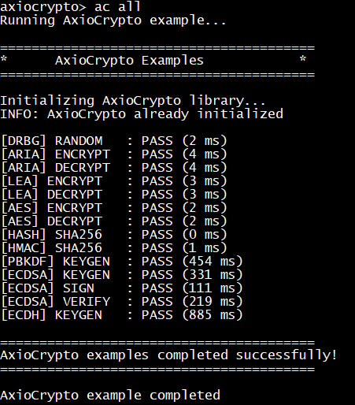

---

### PQC Examples

#### Run All

```text
pqc all
```

#### Run Individually

```text
pqc aimer128f
pqc haetae2
pqc dilithium2
pqc sphincs128f
pqc falcon512
pqc kyber512
pqc ntru768
pqc smaug1
```

On success, each example prints `PASS` along with the execution time.

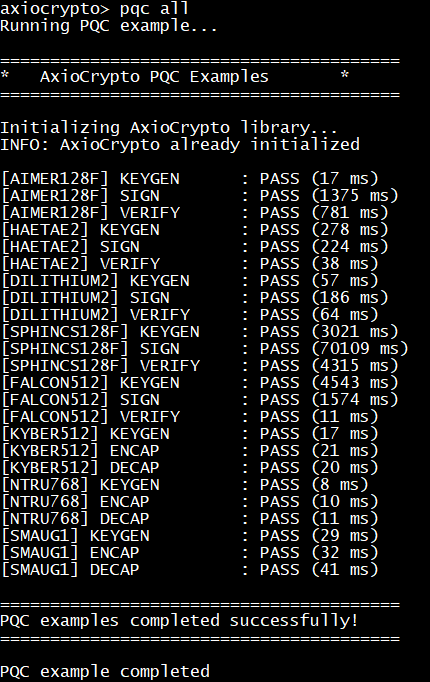

---

### KeyStorage Example

This example stores an ARIA encryption/decryption key in KeyStorage and uses it.

| Command | Description |
|---------|-------------|
| `ks set` | Store key |
| `ks chk` | Check if key exists |
| `ks test` | Encryption/decryption test using the stored key |
| `ks del` | Delete key |


---

### Other Commands

#### Log Output

```text
log on
log off
```

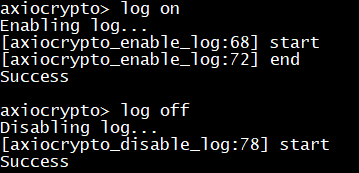

#### Integrity Check

```text
int on
int off
```

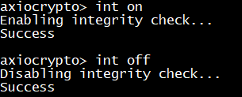

#### Exit

```text
exit
```

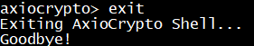

---

## Troubleshooting

### Build Failure

- Verify the M2354BSP path is correct
- Verify the include paths are correct
- Verify `Stack_Size` and `Heap_Size` defines are applied

### No UART Output After Download

- Check UART0 pin connections (PA6: RXD, PA7: TXD)
- Check board power and Nu-Link connection
- Verify 115200 bps setting
- Verify `main.c` reaches `example()` successfully

### Example Execution Failure

- Verify `init` and `act` have been run in order
- Check activation status using `status`
- Check validation mode setting
- Check for memory configuration and scatter file conflicts
