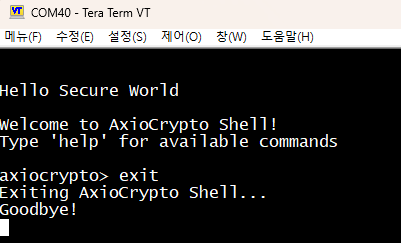

# AxioCryptoM v1 Example - STM32H563-TZ

> Korean version: [README_KR.md](README_KR.md)

## Overview

This is an AxioCryptoM v1 library example project targeting the STM32H563 TrustZone (Cortex-M33).

This example is structured as **two STM32CubeIDE projects — Secure and NonSecure**. The AxioCrypto library runs within the **Secure project**.

---

## Development Environment

| Item | Description |
|------|-------------|
| MCU | STM32H563ZI (Cortex-M33) |
| Toolchain | STM32CubeIDE |
| Debug Interface | ST-LINK |
| Debug UART | USART3, 115200 bps |
| Architecture | TrustZone Secure / NonSecure |

---

## Directory Structure

Recommended layout:

```text
axiocrypto_examples/
STM32H563-TZ/
├─ docs/
├─ lib/
└─ project/
   ├─ Drivers/
   ├─ Secure/
   ├─ NonSecure/
   └─ Secure_nsclib/
```

> **Important:** The `Secure` project references `../lib` and `../../axiocrypto_examples` via linked resources.
> The project must be imported while **maintaining the relative path structure** after extraction.
> The `NonSecure` project uses `secure_nsclib.o` generated by the `Secure` build, so both projects must be managed together.

---

## Memory Layout

STM32H563 total memory capacity:

| Type | Flash | RAM |
|------|-------|-----|
| STM32H563 Total | 2048 KB | 640 KB |

### Flash / RAM Regions (Based on Secure Linker Script)

| Region | Start Address | End Address | Size | Description |
|--------|---------------|-------------|------|-------------|
| AxioCrypto Flash | `0x0C020000` | `0x0C033FFF` | 80 KB | **AxioCrypto library code (reserved)** |
| KeyStorage Flash | `0x0C034000` | `0x0C037FFF` | 16 KB | **KeyStorage dedicated region (reserved)** |
| AxioCrypto RAM | `0x30000000` | `0x30000FFF` | 4 KB | **AxioCrypto data area (reserved)** |

### Memory Notes

- Customer firmware code and data must not overlap with the AxioCrypto reserved regions.
- If the KeyStorage feature is used, the KeyStorage Flash region must also be reserved.
- Ensure Stack and Heap settings do not conflict with the AxioCrypto RAM region.
- The AxioCrypto Flash/RAM regions must be configured in the customer project's linker script.
- After the final firmware build, verify the memory map to confirm there are no region conflicts.

---

## Project Structure

```
STM32H563-TZ_Secure (STM32CubeIDE Project)
├── Core/
│   ├── Inc/                        # Header files
│   ├── Src/
│   │   ├── main.c                  # Main source file
│   │   ├── secure_nsc.c            # NonSecure Callable functions
│   │   ├── system_stm32h5xx_s.c    # System initialization
│   │   └── stm32h5xx_it.c          # Interrupt handlers
│   └── Startup/                    # Startup code
├── Drivers/                        # STM32H5xx HAL drivers
├── AxioCryptoM/                    # AxioCrypto library (linked folder)
│   ├── libaxiocrypto_1.0_stm32h563-tz_ce.a  # AxioCrypto library (prebuilt)
│   ├── axiocrypto.h                          # AxioCrypto main header
│   ├── axiocrypto_defines.h                  # Constants / type definitions header
│   └── axiocrypto_pqc.h                      # PQC (Post-Quantum Cryptography) header
└── AxioCryptoM_Example/            # Example sources (linked folder)
    ├── example.c                   # Example entry point
    ├── example_axiocrypto.c        # AxioCrypto examples
    ├── example_pqc.c               # PQC examples
    ├── example_util.c              # Example utilities
    └── example_util.h              # Example utilities header

STM32H563-TZ_NonSecure (STM32CubeIDE Project)
├── Core/
│   └── Src/
│       └── main.c                  # NonSecure main (jumps after Secure exits)
└── Drivers/
```

### Linker Scripts

| File | Description |
|------|-------------|
| `STM32H563ZITX_FLASH_AXIOCRYPTOM.ld` | For Secure project (includes AxioCrypto regions) |
| `STM32H563ZITX_FLASH.ld` | For NonSecure project |

---

## AxioCrypto Integration Guide

### Memory Requirements

| Region | Setting |
|--------|---------|
| Heap | `_Min_Heap_Size = 0x14000` |
| Stack | `_Min_Stack_Size = 0x8000` |

### Dedicated Hardware Modules

The AxioCrypto library uses the following hardware modules internally.

| Module | Note |
|--------|------|
| HASH / PKA / RNG | Reserved for AxioCrypto exclusive use |

### Notes

- If the AxioCrypto-dedicated hardware modules are used directly by the application, the cryptographic module may malfunction.
- AxioCrypto APIs are not Thread-Safe. Calling these APIs simultaneously from multiple threads in a multi-threaded environment may cause unexpected behavior.
- Due to the TrustZone configuration, AxioCrypto APIs can only be called from the Secure context.

---

## STM32CubeIDE Project Import

### Import Secure Project

Import the following path in STM32CubeIDE.

```text
project/Secure
```

Project name: `STM32H563-TZ_Secure`

### Import NonSecure Project

Import the following path in STM32CubeIDE.

```text
project/NonSecure
```

Project name: `STM32H563-TZ_NonSecure`

### Post-Import Verification

Confirm the following linked folders are visible in the Secure project:

- `AxioCryptoM`
- `AxioCryptoM_Example`

If they are not visible, the relative paths are broken. Re-check the extraction location and the project import path.


---

## Build Settings

### Secure Project

- Linker Script: `STM32H563ZITX_FLASH_AXIOCRYPTOM.ld`
- Library: `libaxiocrypto_1.0_stm32h563-tz_ce.a`
- Compile Option: `-mcmse`
- Defines: `DEBUG`, `USE_HAL_DRIVER`, `STM32H563xx`
- Include Paths:
  - `Core/Inc`
  - `../Secure_nsclib`
  - `../Drivers/STM32H5xx_HAL_Driver/Inc`
  - `../Drivers/CMSIS/Device/ST/STM32H5xx/Include`
  - `../Drivers/CMSIS/Include`


### NonSecure Project

- Linker Script: `STM32H563ZITX_FLASH.ld`
- User Object: `${workspace_loc:/STM32H563-TZ_Secure/Debug/secure_nsclib.o}`
- Include Paths:
  - `Core/Inc`
  - `../Secure_nsclib`
  - `../Drivers/STM32H5xx_HAL_Driver/Inc`
  - `../Drivers/CMSIS/Device/ST/STM32H5xx/Include`
  - `../Drivers/CMSIS/Include`


---

## Build

**The Secure project must be built first** to generate `secure_nsclib.o`, after which the NonSecure project can be built successfully.

Recommended build order:

1. Build `STM32H563-TZ_Secure`
2. Build `STM32H563-TZ_NonSecure`

Confirm the following on a successful build:

- Secure ELF generated
- NonSecure ELF generated
- `secure_nsclib.o` generated
- No link errors
- No `.axiocrypto_code` region conflicts


---

## TrustZone / Option Bytes Settings

This example requires TrustZone Secure / NonSecure partitioning.

When applying to a board for the first time, **Option Bytes / TrustZone settings in STM32CubeProgrammer** must match the project configuration.


> If the Option Bytes settings differ, the Secure / NonSecure images may not run correctly.
> If the TrustZone partition has been changed, align the settings before re-downloading.

---

## UART Terminal Connection

Connect a terminal to USART3 with the following settings.

| Item | Setting |
|------|---------|
| Baud Rate | 115200 |
| Data Bits | 8 |
| Parity | None |
| Stop Bits | 1 |
| Flow Control | None |

---

## Firmware Download

Recommended order:

1. Download Secure project
2. Download NonSecure project
3. Confirm initial screen is displayed after reset

The Secure project must be downloaded to the Secure region, and the NonSecure project to the NonSecure region.


---

## Running Examples

After connecting the board and downloading the firmware, run examples via the AxioCrypto Shell on the USART3 terminal.

### Basic Procedure

#### 1. Show Help

```text
help
```


#### 2. Initialize Library

```text
init
```


#### 3. Activate Module

```text
act
```


#### 4. Check Status

```text
status
```


#### 5. Set Validation Mode (Optional)

To test non-validated algorithms (e.g., AES), change the validation mode to `none`.

- Compares the current mode with the requested mode.
- If a change is required, `axiocrypto_set_mode()` is called and the device **reboots**.
- If the mode is already set to the requested value, no change is made.

```text
mode none
mode kcmvp
```


---

### AxioCrypto Algorithm Examples

#### Run All

```text
ac all
```

#### Run Individually

```text
ac drbg
ac aria
ac lea
ac aes
ac hash
ac hmac
ac pbkdf
ac ecdsa
ac ecdh
```

On success, each example prints `PASS` along with the execution time.


---

### PQC Examples

#### Run All

```text
pqc all
```

#### Run Individually

```text
pqc aimer128f
pqc haetae2
pqc dilithium2
pqc sphincs128f
pqc falcon512
pqc kyber512
pqc ntru768
pqc smaug1
```

On success, each example prints `PASS` along with the execution time.


---

### KeyStorage Example

This example stores an ARIA encryption/decryption key in KeyStorage and uses it.

| Command | Description |
|---------|-------------|
| `ks set` | Store key |
| `ks chk` | Check if key exists |
| `ks test` | Encryption/decryption test using the stored key |
| `ks del` | Delete key |


---

### Other Commands

#### Log Output

```text
log on
log off
```


#### Integrity Check

```text
int on
int off
```


#### Exit

```text
exit
```

After `exit`, the Secure Shell terminates and jumps to the NonSecure application.



---

## Troubleshooting

### Build Failure

- Verify the Secure project is using `STM32H563ZITX_FLASH_AXIOCRYPTOM.ld`
- Verify the linked folders (`AxioCryptoM`, `AxioCryptoM_Example`) are intact in the Secure project
- Verify the Secure project was built first
- Verify `secure_nsclib.o` was generated
- Verify `libaxiocrypto_1.0_stm32h563-tz_ce.a` is linked correctly

### No UART Output After Download

- Verify USART3 is configured at 115200 bps
- Verify the Secure image was downloaded first
- Verify TrustZone Option Bytes settings match the example configuration
- Verify the Secure project boots correctly

### Example Execution Failure

- Verify `init` has been run
- If activation is required, verify `act` has been executed
- Check activation / mode / integrity status using `status`
