# AxioCryptoM v1 Example - STM32H563-TZ

> English version: [README.md](README.md)

## 개요

STM32H563 TrustZone (Cortex-M33) 을 대상으로 하는 AxioCryptoM v1 라이브러리 예제 프로젝트입니다.

본 예제는 **STM32CubeIDE 기반 Secure / NonSecure 2개 프로젝트 구조**로 구성되어 있으며, AxioCrypto 라이브러리는 **Secure 프로젝트**에 포함되어 동작합니다.

---

## 개발 환경

| 항목 | 내용 |
|------|------|
| MCU | STM32H563ZI (Cortex-M33) |
| Toolchain | STM32CubeIDE |
| Debug Interface | ST-LINK |
| Debug UART | USART3, 115200 bps |
| 아키텍처 | TrustZone Secure / NonSecure |

---

## 디렉토리 배치

권장 구조:

```text
axiocrypto_examples/
STM32H563-TZ/
├─ docs/
├─ lib/
└─ project/
   ├─ Drivers/
   ├─ Secure/
   ├─ NonSecure/
   └─ Secure_nsclib/
```

> **중요:** `Secure` 프로젝트는 linked resource를 통해 `../lib`, `../../axiocrypto_examples`를 참조합니다.
> 압축 해제 후 **상대 경로 구조를 유지한 상태**로 프로젝트를 import 해야 합니다.
> `NonSecure` 프로젝트는 `Secure` 빌드 시 생성되는 `secure_nsclib.o`를 사용하므로 두 프로젝트를 함께 관리해야 합니다.

---

## 메모리 레이아웃

STM32H563 전체 메모리 용량:

| 구분 | Flash | RAM |
|------|-------|-----|
| STM32H563 Total | 2048 KB | 640 KB |

### Flash / RAM 영역 (Secure Linker Script 기준)

| 영역 | 시작 주소 | 종료 주소 | 크기 | 설명 |
|------|-----------|-----------|------|------|
| AxioCrypto Flash | `0x0C020000` | `0x0C033FFF` | 80 KB | **AxioCrypto 라이브러리 코드 (예약 영역)** |
| KeyStorage Flash | `0x0C034000` | `0x0C037FFF` | 16 KB | **KeyStorage 전용 영역 (예약 영역)** |
| AxioCrypto RAM | `0x30000000` | `0x30000FFF` | 4 KB | **AxioCrypto 데이터 영역 (예약 영역)** |

### 메모리 주의사항

- 고객 펌웨어의 코드 및 데이터는 AxioCrypto 예약 영역과 겹치면 안 됩니다.
- KeyStorage 기능을 사용하는 경우 KeyStorage Flash 영역도 함께 예약해야 합니다.
- Stack 및 Heap 설정 시 AxioCrypto RAM 영역과 충돌하지 않도록 해야 합니다.
- 고객사 프로젝트의 linker script에서 AxioCrypto Flash/RAM 영역을 반드시 설정해야 합니다.
- 최종 펌웨어 빌드 후 메모리 맵을 확인하여 영역 충돌이 없는지 검증해야 합니다.

---

## 프로젝트 구조

```
STM32H563-TZ_Secure (STM32CubeIDE Project)
├── Core/
│   ├── Inc/                        # 헤더 파일
│   ├── Src/
│   │   ├── main.c                  # 메인 소스 파일
│   │   ├── secure_nsc.c            # NonSecure Callable 함수
│   │   ├── system_stm32h5xx_s.c    # 시스템 초기화
│   │   └── stm32h5xx_it.c          # 인터럽트 핸들러
│   └── Startup/                    # 스타트업 코드
├── Drivers/                        # STM32H5xx HAL 드라이버
├── AxioCryptoM/                    # AxioCrypto 라이브러리 (linked folder)
│   ├── libaxiocrypto_1.0_stm32h563-tz_ce.a  # AxioCrypto 라이브러리 (prebuilt)
│   ├── axiocrypto.h                          # AxioCrypto 메인 헤더
│   ├── axiocrypto_defines.h                  # 상수/타입 정의 헤더
│   └── axiocrypto_pqc.h                      # PQC (양자 내성 암호) 헤더
└── AxioCryptoM_Example/            # 예제 소스 (linked folder)
    ├── example.c                   # 예제 진입점
    ├── example_axiocrypto.c        # AxioCrypto 예제
    ├── example_pqc.c               # PQC 예제
    ├── example_util.c              # 예제 유틸리티
    └── example_util.h              # 예제 유틸리티 헤더

STM32H563-TZ_NonSecure (STM32CubeIDE Project)
├── Core/
│   └── Src/
│       └── main.c                  # NonSecure 메인 (Secure 종료 후 점프)
└── Drivers/
```

### Linker Script

| 파일 | 설명 |
|------|------|
| `STM32H563ZITX_FLASH_AXIOCRYPTOM.ld` | Secure 프로젝트용 (AxioCrypto 영역 포함) |
| `STM32H563ZITX_FLASH.ld` | NonSecure 프로젝트용 |

---

## AxioCrypto 연동 가이드

### 메모리 요구사항

| 영역 | 설정값 |
|------|--------|
| Heap | `_Min_Heap_Size = 0x14000` |
| Stack | `_Min_Stack_Size = 0x8000` |

### 전용 하드웨어 모듈

AxioCrypto 라이브러리는 내부적으로 아래 하드웨어 모듈을 사용합니다.

| 모듈 | 비고 |
|------|------|
| HASH / PKA / RNG | AxioCrypto 전용 사용 |

### 주의사항

- AxioCrypto 전용 하드웨어 모듈을 애플리케이션에서 직접 사용할 경우, 암호 모듈이 오동작할 수 있습니다.
- AxioCrypto API는 Thread-Safe를 보장하지 않습니다. 멀티스레드 환경에서 여러 스레드가 동시에 이 API를 호출할 경우 예기치 않은 동작이 발생할 수 있으므로 주의하십시오.
- TrustZone 구성상 AxioCrypto API는 Secure 컨텍스트에서만 호출 가능합니다.

---

## STM32CubeIDE 프로젝트 Import

### Secure 프로젝트 Import

STM32CubeIDE에서 아래 경로를 import 합니다.

```text
project/Secure
```

프로젝트 이름: `STM32H563-TZ_Secure`

### NonSecure 프로젝트 Import

STM32CubeIDE에서 아래 경로를 import 합니다.

```text
project/NonSecure
```

프로젝트 이름: `STM32H563-TZ_NonSecure`

### Import 후 확인 사항

Secure 프로젝트에서 아래 linked folder가 정상적으로 보이는지 확인합니다.

- `AxioCryptoM`
- `AxioCryptoM_Example`

정상적으로 보이지 않으면 상대 경로가 깨진 상태이므로, 압축 해제 위치와 프로젝트 import 경로를 다시 확인해야 합니다.

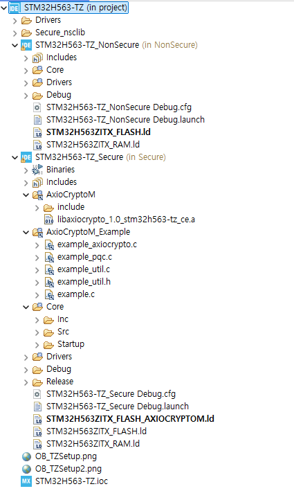

---

## 빌드 설정 확인

### Secure 프로젝트

- Linker Script: `STM32H563ZITX_FLASH_AXIOCRYPTOM.ld`
- Library: `libaxiocrypto_1.0_stm32h563-tz_ce.a`
- Compile Option: `-mcmse`
- Defines: `DEBUG`, `USE_HAL_DRIVER`, `STM32H563xx`
- Include Path:
  - `Core/Inc`
  - `../Secure_nsclib`
  - `../Drivers/STM32H5xx_HAL_Driver/Inc`
  - `../Drivers/CMSIS/Device/ST/STM32H5xx/Include`
  - `../Drivers/CMSIS/Include`

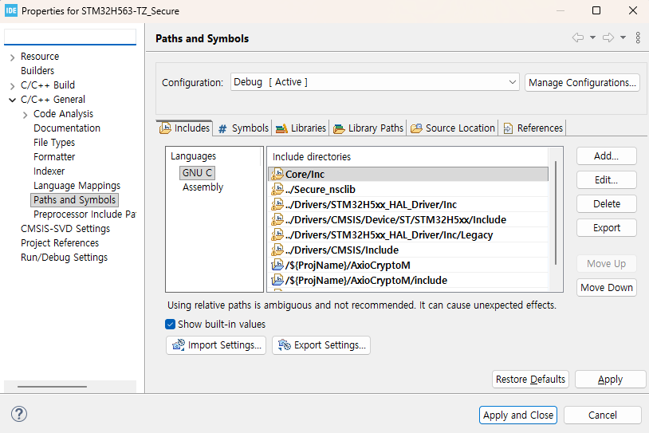

### NonSecure 프로젝트

- Linker Script: `STM32H563ZITX_FLASH.ld`
- User Object: `${workspace_loc:/STM32H563-TZ_Secure/Debug/secure_nsclib.o}`
- Include Path:
  - `Core/Inc`
  - `../Secure_nsclib`
  - `../Drivers/STM32H5xx_HAL_Driver/Inc`
  - `../Drivers/CMSIS/Device/ST/STM32H5xx/Include`
  - `../Drivers/CMSIS/Include`

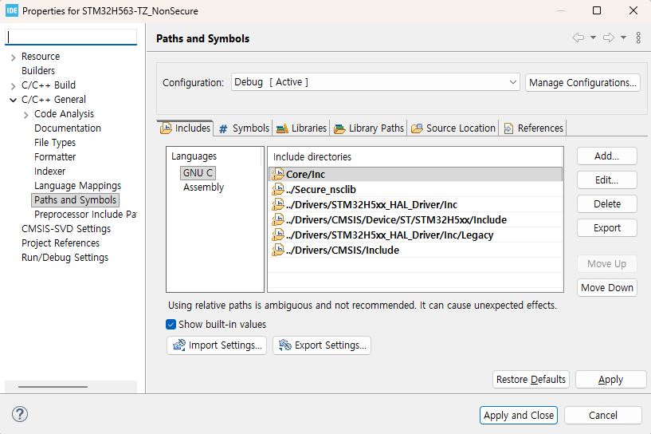

---

## 빌드

**Secure 프로젝트를 먼저 빌드해야** `secure_nsclib.o`가 생성되고, 이후 NonSecure 프로젝트가 정상 빌드됩니다.

권장 빌드 순서:

1. `STM32H563-TZ_Secure` 빌드
2. `STM32H563-TZ_NonSecure` 빌드

정상 빌드 시 확인 항목:

- Secure ELF 생성
- NonSecure ELF 생성
- `secure_nsclib.o` 생성
- 링크 에러 없음
- `.axiocrypto_code` 영역 관련 충돌 없음


---

## TrustZone / Option Bytes 설정

이 예제는 TrustZone Secure / NonSecure 분할을 전제로 합니다.

보드에 처음 적용하는 경우 **STM32CubeProgrammer에서 Option Bytes / TrustZone 설정**이 프로젝트와 일치해야 합니다.

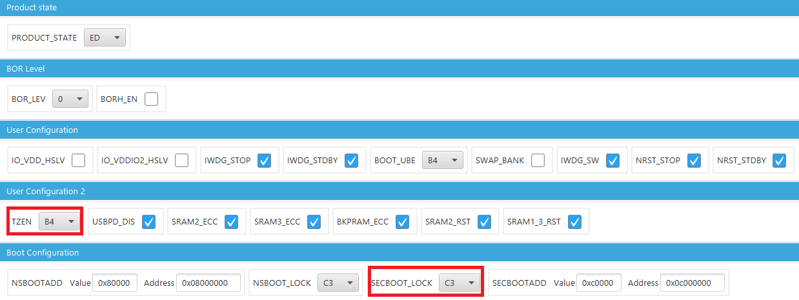
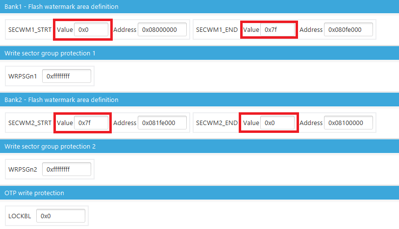

> Option Bytes 설정이 다르면 Secure / NonSecure 이미지가 정상적으로 실행되지 않을 수 있습니다.
> TrustZone 분할이 변경된 상태라면 먼저 설정을 맞춘 뒤 다시 다운로드해야 합니다.

---

## UART 터미널 연결

USART3 기준으로 터미널을 연결합니다.

| 항목 | 설정 |
|------|------|
| Baud Rate | 115200 |
| Data Bits | 8 |
| Parity | None |
| Stop Bits | 1 |
| Flow Control | None |

---

## 펌웨어 다운로드

권장 순서:

1. Secure 프로젝트 다운로드
2. NonSecure 프로젝트 다운로드
3. 리셋 후 초기 화면 출력 확인

Secure 프로젝트는 Secure 영역에, NonSecure 프로젝트는 NonSecure 영역에 각각 다운로드되어야 합니다.

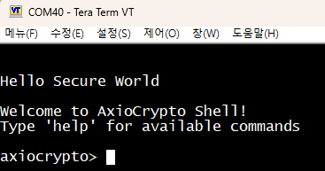

---

## 예제 실행

보드를 연결하고 펌웨어를 다운로드한 후, USART3 터미널에서 AxioCrypto Shell을 통해 예제를 실행할 수 있습니다.

### 기본 실행 절차

#### 1. 도움말 확인

```text
help
```


#### 2. 라이브러리 초기화

```text
init
```


#### 3. 모듈 활성화

```text
act
```


#### 4. 상태 확인

```text
status
```

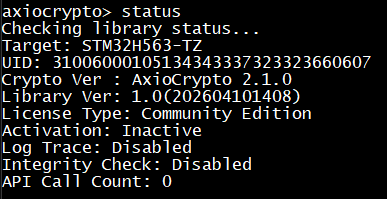

#### 5. 검증 모드 설정 (선택)

비검증 알고리즘(AES) 테스트를 하기 위해서는 검증 모드를 none으로 변경해야 합니다.

- 현재 설정된 mode와 요청 mode를 비교합니다.
- 변경이 필요한 경우 `axiocrypto_set_mode()`를 호출하며, 이후 **리부팅**됩니다.
- 이미 동일한 mode로 설정된 경우에는 변경하지 않습니다.

```text
mode none
mode kcmvp
```

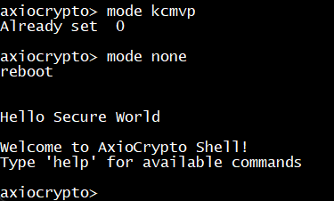

---

### AxioCrypto 알고리즘 예제

#### 전체 실행

```text
ac all
```

#### 개별 실행

```text
ac drbg
ac aria
ac lea
ac aes
ac hash
ac hmac
ac pbkdf
ac ecdsa
ac ecdh
```

성공 시 예제별로 `PASS`와 함께 수행 시간이 출력됩니다.

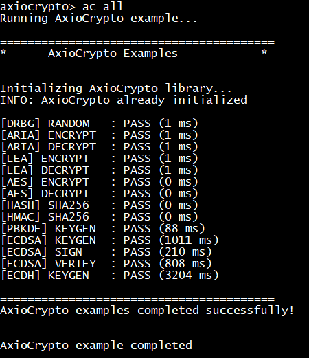

---

### PQC 예제

#### 전체 실행

```text
pqc all
```

#### 개별 실행

```text
pqc aimer128f
pqc haetae2
pqc dilithium2
pqc sphincs128f
pqc falcon512
pqc kyber512
pqc ntru768
pqc smaug1
```

성공 시 예제별로 `PASS`와 함께 수행 시간이 출력됩니다.

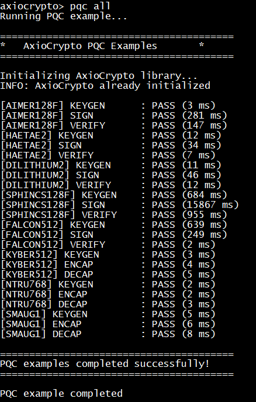

---

### KeyStorage 사용 예제

ARIA 암복호화용 키를 KeyStorage에 저장하여 사용하는 예제입니다.

| 명령어 | 설명 |
|--------|------|
| `ks set` | 키 저장 |
| `ks chk` | 키 존재 여부 확인 |
| `ks test` | KeyStorage에 저장된 키로 암/복호화 테스트 수행 |
| `ks del` | 키 삭제 |

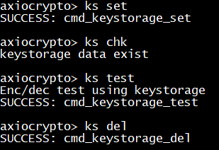

---
